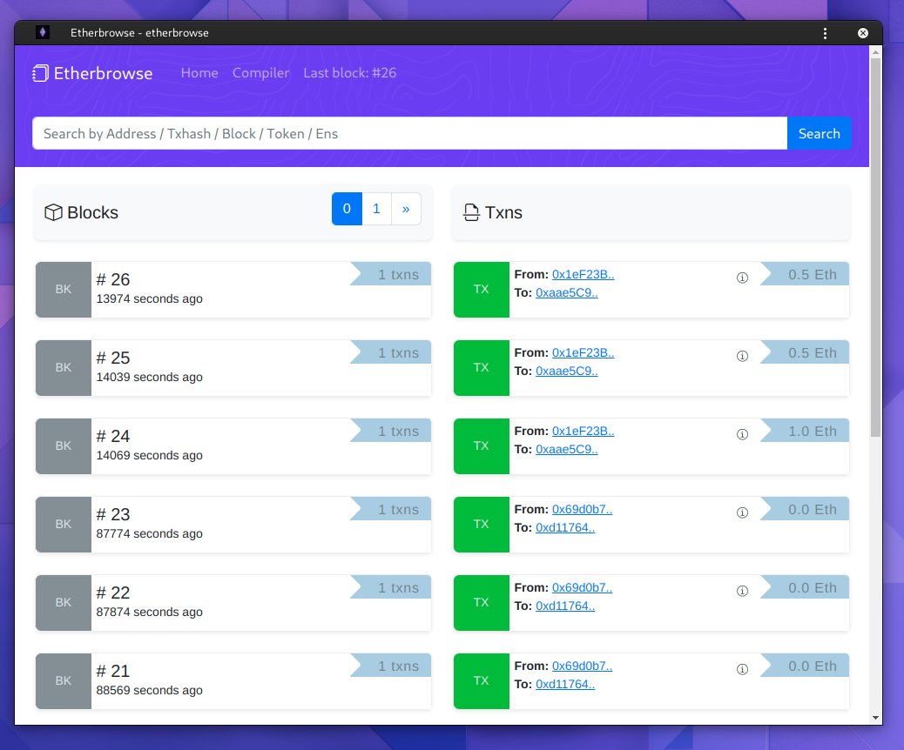

# EtherBrowse

## Build your own EtherBrowse with web3.py

## Before you run it

Create an .env with:

NODO_URL="[http/https]://[RPC-URL]"
FLASK_APP=app 
FLASK_ENV=development

## Run it

pip3 install -r requirements.txt

export FLASK_APP=app

export FLASK_ENV=development

flask run

## Docker:

docker build -t etherbrowse -f Dockerfile .

docker container run -p 5000:5000 -dit --name etherbrowse etherbrowse

## Screenshot:

## Reference: 

